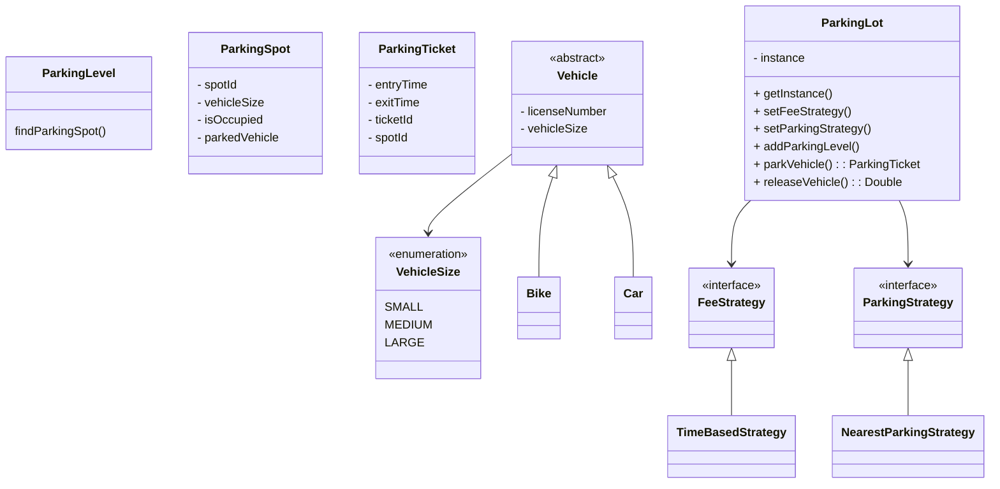

# Parking Lot

---

## Problem Statement
Design & Implement a Parking Lot Management System that supports vehicle 
parking, unparking, ticketing, fee calculation & management of multiple 
floors & spot types.  

---

## Requirements:
  - Multiple Floors
  - Parking Spots
  - Vehicles 
  - Ticketing
  - Parking/Unparking
  - Fee Calculation - Business Logic
  - Spot Allocation - Business Logic
  - Extensibility

---

---

## Entities:
  - ParkingSPot
  - ParkingLevel
  - ParkingTicket
  - VehicleSize
  - Vehicle
  - Bike
  - Car
  - Truck
  - FeeStrategy
  - TimeBasedFeeStrategy
  - FlatRateFeeStrategy
  - ParkingStrategy
  - NearestParkingStrategy
  - ParkingLot
  - ParkingLotDemo

----

## Design Notes

### Design Patterns:
- **Singleton** ParkingLot
- **Strategy** FeeStrategy & Parking Strategy.
- **Factory Pattern (extension)** create Vehicle based on input.
- **Observer (extension)** notify of available spots

### Do's
- VehicleSize: loosely couples Vehicle & Spot
- hidden entities: VehicleSize, ParkingTicket, FeeStrategy, ParkingStrategy
- hidden methods: ParkingLevel.displayAvailability()
- Notable Methods:
    public Optional<ParkingTicket> parkVehicle(Vehicle vehicle)
    public Optional<Double> releaseVehicle(String licenseNumber)
    Optional<ParkingSpot> ParkingLevel.findAvailableSpots(VehicleSize)

### Don'ts:
  - Vehicle: is abstract and not part of Entities, put in it's own package
  - id: ParkingTicketId/SpotID avoid long/int and leverage UUID
  - VehicleType: Not Required
